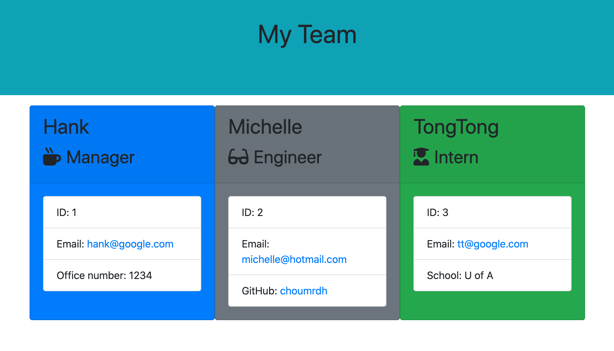

# Project Title: 10_OOP_TemplateEngine :raised_hands:
  - Node CLI that takes in information about employees and generates an HTML webpage that displays summaries for each person. :bulb: 

  ## Table of Contents:
  - [User Story](#user-story-speech_balloon)
  - [Installation](#installation-floppy_disk)
  - [Usage](#usage)
  - [Contribution](#contribution-handshake)
  - [Author](#author-bust_in_silhouette)
    - [Name](#author-bust_in_silhouette)
    - [GitHub](#author-bust_in_silhouette)
    - [Email](#author-bust_in_silhouette)
  - [License](#license-trophy)
  
  ### User Story :speech_balloon:
```
  - As a manager, I want to generate a webpage that displays my team's basic info 
  so that I have quick access to emails and GitHub profiles.
```
  ###  Installation :floppy_disk::
  
```
    - dependencies: inquirer 
    - devDependencies": jest 
```
  ### Usage

   > var 10_OOP_TemplateEngine = require("10_OOP_TemplateEngine")
  

 ### Contribution :handshake: 
 
 [](https://github.com/choumrdh/10_OOP_TemplateEngine/issues)
  
  
 
  
  #### 	Author :bust_in_silhouette:
   - Name: Michelle [](https://github.com/choumrdh?tab=followers)
  
  > - GitHub: [choumrdh](https://github.com/choumrdh) 
  
 ### License :trophy:
   - [](https://github.com/choumrdh)

##### Example Video:
> click on picture to watch my example
> [](https://drive.google.com/file/d/1eOaQaPwAWS0MhMnQ4ESgPjFcQmFmh6RP/view)